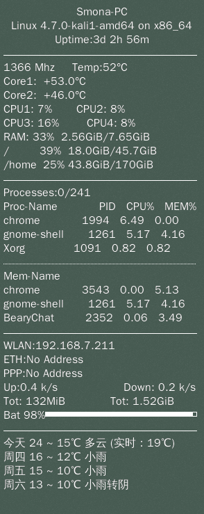

# CustomConky  
自用conky配置

#开发环境   
debian系[Debian/Ubuntu/Mint/Kali]的linuxOS  
apt中安装的conky  
python3  
python3的requests模块  


#准备  

>因为要用到百度的天气接口，所以先去申请一个车联网的api的**开发者ak**，下面是link  
>  
>百度车联网天气接口文档==>http://developer.baidu.com/map/carapi-7.htm  
>  
>这个接口每天可以免费请求5000次左右  

#安装示范  

```
sudo su #切换为root权限
cd /etc
git clone git@github.com:silbertmonaphia/CustomConky.git
rm -r  /etc/conky/
mv /etc/CustomConky/  /etc/conky/
cd /etc/conky/
touch config.json
echo "*/5  *  * * *  root  python3 /etc/conky/weather.py  > /etc/conky/tianqi.log " >> /etc/crontab
#每五分钟请求，刷新一次天气数据
```

#config.json配置示范  

```
{
   "city":"你所在的城市",
   "ak":"上面你请求的百度开发者ak"
}

```

#测试 

```
sudo su
python3 /etc/conky/weather.py > /etc/conky/tianqi.log
cat /etc/conky/tianqi.log
#如果有类似下面的输出，则测试通过
'''
今天 24 ~ 15℃   明天 21 ~ 13℃
后天 16 ~ 12℃   大后天 14 ~ 9℃
'''

```
#桌面效果示范
14英寸笔记本屏幕大小显示效果:  
 
